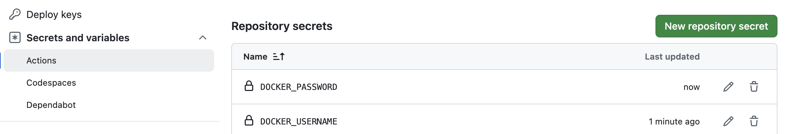

# Github Action: Build and Push Docker Image

# Step 1: Create a Docker Hub account
Go to [hub.docker.com](https://hub.docker.com) to create an account. Make sure to remember your docker hub's username and password :D.

# 🔑 Step 2: Add Secrets to GitHub

Go to your repo:

👉 **Settings → Secrets and variables → Actions → New repository secret**

Add these:
- `DOCKER_PASSWORD`
- `DOCKER_USERNAME`

Example:


# 🔑 Step 3: Add A Step to Your Job
1. Add step below to your `ci.yml`:
```yml
- name: Build and Push Docker Image
  uses: mr-smithers-excellent/docker-build-push@v4
  with:
    image: hiengmao/sample-live-chat-app
    registry: docker.io
    username: ${{ secrets.DOCKER_USERNAME }}
    password: ${{ secrets.DOCKER_PASSWORD }}
```

2. Change `with:` -> `image: hiengmao/sample-live-chat-app` to your own docker hub account.

# 🔑 Step 4: Check Docker Image on Docker Hub
Go to [https://hub.docker.com/repositories/](https://hub.docker.com/repositories) to see your docker image you have been pushed.

# 🔑 Step 5: Screenshoot/Provide Link Your Docker Hub
1. Screenshot/copy link your docker hub page that contains docker image you have pushed.
2. Submit the screenshot to assignment

>> Score: 10 points

Example:

